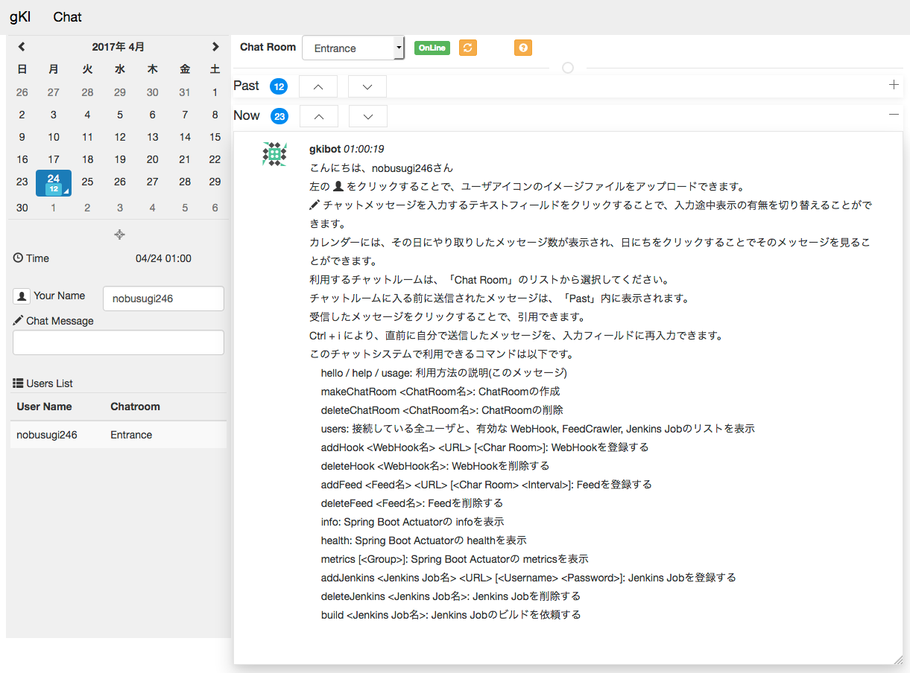

= groovy Knowledge Integrator
:toc:
:toclevels: 5
:example-caption: List

An application for Knowledge Integration by grails/groovy.
Now only a Chat Microservice with groovy chatbot system.

== ScreenShot

.ScreenShot of this Chat Application

== Features

This is a Chat Application builded by Grails Ver.3.1.

. Chatbot by groovy language.
** Now only embedded one. It will be connected with other microservices of bots.
** Displays Spring Boot Actuator info / health / metrics of this Chat Server.
. Accepts Github webhooks.
** Now tested by Gitbucket's webhooks.
** Payload URL (ex. http://localhost:8080/chat/webhook/) with
   Content type "application/x-www-form-urlencoded".
. Crawls Feeds of Atom / RSS / RDF. If updated, sends them to selected Chat Room.
. Calls Jenkins to build Pipeline.
. User Icon (Identicon) by Jdenticon.
. Chat Rooms.
. Chat log display by selecting a day on Calendar.

.Outline
image::images/about.png[width=750]

この図の矢印は、情報の流れを示しています。

(1) いわゆるチャットによるコミュニケーション。必要に応じて ChatRoomの作成、削除を行なえます。

(2) プロジェクトで使用しているレポジトリ(GitHub, GitLab, GitBucket)の変更や、
Pull Requestの通知、Issueの追加 / 削除などが、WebHookによりチャットとして表示されます。

(3) Jenkinsに定義された Pipelineの実行を、チャットにより指示できます。

(4) 社内に乱立している Redmineプロジェクトの活動状況や、世界中の Blogや NEWSの情報、
GitHubでの開発者の Public Activity、Jenkinsによるビルド状況などについて、
変化が随時チャットとして時系列で表示されます。

これらの活動が、発生順に、時系列に並べられてチャットとして表示される。
適宜、ChatRoomを作成して振り分けることで、分類し、見通しを良くできます。

== How to run / 実行方法

Download `gki-0.1.16.jar` from
https://github.com/nobusugi246/groovy-knowledge-integrator/releases[releases]
link, then

.How to run this application
====
----
$ java -jar gki-0.1.16.jar
----
====

And access http://localhost:8080/chat/index from your Browser.

If you want to change port number(ex. 8081), then

.How to change port number
====
----
$ java -jar gki-0.1.16.jar --server.port=8081
----
====

== How to use / 利用方法

=== 初期表示

ブラウザで http://localhost:8080/chat/index にアクセスします。
最初のアクセスであれば、以下の様に表示されます。

.初期表示
image::images/index00.png[]

まず「Your Name」フィールドに名前を記入します。
それから Tabキーまたはマウスにより、
「Chat Message」フィールドにフォーカスを移動します。
これにより、次の様にメッセージが表示されます。
(このメッセージは、新規のユーザが接続したときか、
`hello` コマンドを送信したときに表示されます。
そのユーザにのみ表示され、他のユーザには見えません。
メッセージの永続化(詳細は後述)もされません。)

.名前設定後の表示
image::images/index01.png[width=800]

「gkibot」は、組み込みの Chatbotです。このチャットシステムを利用するための案内役です。
表示されるコマンドは、その時点で利用できるものが表示されます。

チャットのメッセージは、以下の様に「Identicon」、「ユーザ名」、「タイムスタンプ」に
続いて表示されます。同じユーザのメッセージが続く場合は、これらは一度だけ表示されます。

.Identicon
image::images/index01a.png[]

「Identicon」は、ユーザを視覚的に識別するためのアイコンです。
「ユーザ名」の文字列から生成されるため、
同じユーザ名であれば同じ Identiconが表示されます。

「Your Name」フィールドに記入した名前は、
「Users in this Chat Room」テーブルに表示されます。

.Chat Roomのユーザ一覧表示
image::images/index01b.png[]

このテーブルには、この Chat Roomにいるユーザの一覧が表示されます。
このチャットサーバに接続しているすべてのユーザを知りたい場合は、
`users` コマンドを実行してください。

「OnLine」表示は、サーバとの接続が切れると、以下の様に「OffLine」と表示されます。

.OffLine表示
image::images/index02.png[]

一時的に通信が切れただけであれば、ブラウザによるページのリロードにより
「OnLine」に戻る場合があります。
それでも「OffLine」のままであれば、サーバの管理者に連絡してください。

=== メッセージの送受信、コマンドの実行

「Chat Message」フィールドに文言を入力し、Returnキーを押すことで、
今いる Chat Roomにメッセージを送信します。
そのメッセージは、その Chat Roomにいるユーザに送信されます。

メッセージの内容がコマンドの形式に一致した場合、
コマンドとして実行されます。

メッセージは基本的に永続化(データベースに記録)されます。
ただし、以下の場合は永続化されません。

. コマンドの応答メッセージで、そのユーザにのみ意味がある場合。
`hello` / `users` / `info` / `health` / `metrics` など、
それを実行したときのユーザにのみ意味がある応答メッセージは、
永続化されません。
他のユーザにも表示されません。
. コマンドの実行がエラーにより失敗した場合のエラー返信メッセージ。
そのコマンドを実行したユーザにはエラーメッセージが返信されますが、
そのエラーの返信メッセージは永続化されません。
他のユーザにも表示されません。

また、メッセージの内容が URL(http:// または https:// ではじまる文字列)に一致した場合、
それはリンクとして表示されます。

==== コマンドの実行例

===== Chat Roomの作成

`makeChatRoom` コマンドを使用します。
コマンドに続いて、作成したい Chat Roomの名前を記載します。
その名前にスペースを含めることはできません。

.Chat Roomの作成例(1/2)
image::images/index04a.png[]

コマンドの実行が成功すれば、
以下のようにコンボボックスに Chat Roomが追加された一覧として表示されます。

.Chat Roomの作成例(2/2)
image::images/index04b.png[]

このコンボボックスで Chat Roomを選択することで、
利用する Chat Roomを変更できます。

===== WebHookの登録

基本的な手順は以下です。

. WebHookを表示する Chat Roomを作成します(必要に応じて)。
. WebHookを表示する Chat Roomに移動し、利用する WebHookを登録します。
. GibHub / GitLab / GitBucket等で、WebHookの設定を行ないます。

ここでは作成した Chat Roomに移動後の手順を説明します。

`addHook` コマンドを使用します。
使用方法は、 `hello` コマンドか、 `addHook` とのみ入力することで表示されます。
`[]` 内の入力は必須ではありません。

.addHookコマンドの入力形式
image::images/index04z.png[]

ここでは localhostの GitBucketサーバと連携するための設定を例に説明します。
以下のように `addHook` コマンドを実行することで、
この Chat Roomに WebHookのメッセージが表示されるようになります。

.WebHookの登録例(1/4)
image::images/index04w.png[]

次に、GitBucket側の設定を行ないます。
以下のように、「Setting」メニューの「Service Hooks」タブを選択します。
新規の登録であれば、右下の「Add webhook」ボタンを押下します。

.WebHookの登録例(2/4)
image::images/index04y.png[width=750]

以下のように、それぞれの項目に記入し、「Add webhook」ボタンを押下します。

.WebHookの登録例(3/4)
image::images/index04x.png[width=750]

GitBucketのレポジトリに Pushされた場合には、以下のように表示されます。

.WebHookの登録例(4/4)
image::images/index04v.png[]

===== Feedの登録

基本的な手順は以下です。

. Feedを表示する Chat Roomを作成します(必要に応じて)。
. Feedを表示する Chat Roomに移動し、利用する Feedを登録します。

ここでは作成した Chat Roomに移動後の手順を説明します。

`addFeed` コマンドを使用します。
使用方法は、 `hello` コマンドか、 `addFeed` とのみ入力することで表示されます。
`[]` 内の入力は必須ではありません。

.addFeedコマンドの入力形式
image::images/index04c.png[]

ここでは、Springの Blogを登録します。
`addFeed` コマンドの記述に問題なければ、gkibotから登録したとの応答があります。
URLが適切であれば、1分以内に、最初の Feedの表示が登録した Feed名によりされます。

.Feedの登録例(1/2)
image::images/index04d.png[]

最新の Feedが 1件表示されます。
タイムスタンプは、Feedに付加されていたものです。
以後は、これよりも新しい Feedが追加されたときに、追加分が随時表示されます。
この追加の確認は、一定間隔で実行されます。その間隔はデフォルトでは 30分です。

この間隔を変更する場合は、以下のようにコマンドを実行します。

.Feedの登録例(2/2)
====
----
addFeed SpringBlog https://spring.io/blog.atom FeedsTimeline 120
----
====

間隔時間(Interval)の単位は分です。

====== Redmineプロジェクト

Redmineのプロジェクトを対象とする場合は、以下のように、「活動」タブを選択します。

.Redmineの「活動」タブを選択
image::images/index04e.png[]

次に、右側に表示される、Feedに含める項目を選択し、「適用」ボタンを押します。

.確認したい「活動」タブの変更内容を選択
image::images/index04f.png[]

次に、右下の「Atom」のリンクを右マウスボタンにより URLをコピーします。

.Feedの URLをコピー
image::images/index04g.png[]

最後に、同様に登録を行ないます。

.Redmineプロジェクトの登録
image::images/index04h.png[]

====== GitHubの開発者の Public Activity

GitHubのレポジトリは直接 Feedとしてあつかえません。
開発者(レポジトリの管理者)であれば、
その「Public Activity」タブの Feedを登録すればよいです。

.GitHubの開発者の Public Activity
image::images/index04j.png[]

=== Jenkin Jobとの連携

Jenkin Jobとの連携は以下ができます。

. Jenkins Jobにビルドの実行を依頼する。
. ビルドの結果を Feedとして(指定した) Chat Roomに表示する。

この連携のための設定は以下の手順になります。

. Feedを表示する Chat Roomを作成します(必要に応じて)。
. Feedを表示する Chat Roomに移動し、Jenkins Jobのビルド実行結果を Feedとして登録します。
. Jenkins Jobを登録します。

ここでは作成した Chat Roomに移動後の手順を説明します。

Jenkins Jobのビルド実行結果を Feedとして登録する場合は、
以下の「RSS全ビルド」の URLを右マウスボタンによりコピーし、
`addFeed` コマンドにより、他の Feedと同様に登録します。

.Jenkins ビルド実行結果の登録
image::images/index04i.png[]

Jenkins Jobの登録には、 `addJenkins` コマンドを利用します。

使用方法は、 `hello` コマンドか、 `addJenkins` とのみ入力することで表示されます。
`[]` 内の入力は必須ではありません。

.addJenkinsコマンドの入力形式
image::images/index04u.png[]

Jenkinsの Web画面で、
それぞれの Jenkins Jobの状況が表示される URLを以下のように登録します。

.Jenkins Jobの登録
image::images/index04t.png[]

ビルドの実行の依頼では、この URLに buildが付加された以下の URLが使用されます。

----
http://localhost:8180/job/gki/build
----

実際に設定とビルドを実行した例を以下に示します。

まず、Jenkins Jobのビルド実行結果の Feedの登録を行ないます。
Feedの確認間隔をデフォルトの 30分より短い 10分として設定しています。

.Jenkins Jobの Feedの登録
image::images/index04s1.png[]

次に Jenkins Jobを登録します。
Jenkinsの設定により認証が必要となっているため、
ユーザ名とパスワードも設定しています。

続いて `build` コマンドにより Jobの実行を依頼し、
その結果が Feedとして表示されます。

.Jenkins Jobの登録と実行、結果の表示
image::images/index04s2.png[]

== Grails Tips

=== @Scheduled Annotation

Since Grails Ver.3.1.7, at the Service Class which has a method with @Scheduled Annotation,
lazyInit should be disabled.

.disable lazyInit
====
[source, groovy]
----
class xxxx {
  static lazyInit = false
...

  @Scheduled(fixedRate=10000L)
  void yyyy() {
...
  }
}
----
====

== License / ライセンス

Apache License Version 2.0

== Acknowledgements / 謝辞

* Many thanks to Grails and it's ecosystem.
** https://grails.org/

* Very good testing samples for Grails, Spring Boot.
** https://github.com/jeffbrown/testingdemo

* Many thanks to Jdenticon.
** https://github.com/dmester/jdenticon

== ChangLog / 変更履歴

* Ver.0.1.16, Use style "word-break: break-all;" to Scaffolding table. : 2016-06-20

* Ver.0.1.15, Minor improvements. : 2016-06-14

* Ver.0.1.14, Fix #4, #20. : 2016-06-12

* Ver.0.1.13, Fix #17. : 2016-06-08

* Ver.0.1.12, Fix #13, #14, #15. : 2016-06-05

* Ver.0.1.11, Upgrade to Grails 3.1.8, fix #11. : 2016-06-01

* Ver.0.1.10, Fix export, add import Configuration with ConfigSlurper. fix #9, #10. : 2016-05-30

* Ver.0.1.9, Upgrade to Grails 3.1.7, add feature of export Configuration. : 2016-05-29

* Ver.0.1.8, Fix #6, #8. : 2016-05-24

* Ver.0.1.7, View only last one item when feed added. : 2016-05-23

* Ver.0.1.6, Add initial FeedCrawler. : 2016-05-22

* Ver.0.1.5, Add initial WebHook Configuration. : 2016-05-19

* Ver.0.1.4, Add delay between messages of list. : 2016-05-15

* Ver.0.1.3, Add link to Issue/Pull Request No. of Chat Message. : 2016-05-13

* Ver.0.1.2, Update to display Spring Boot Actuator info/health/metrics, and accept Github webhooks. : 2016-05-12

* Ver.0.1.1, Add log viewer by selected date and `users` command. : 2016-05-10

* Ver.0.1.0, Initial release. : 2016-05-09

